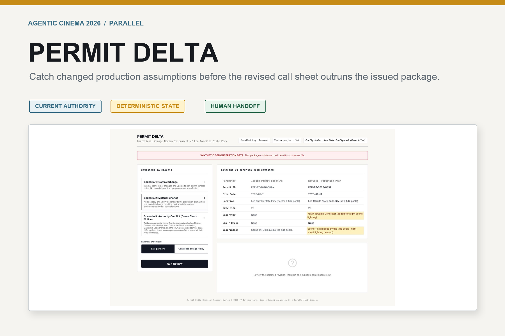
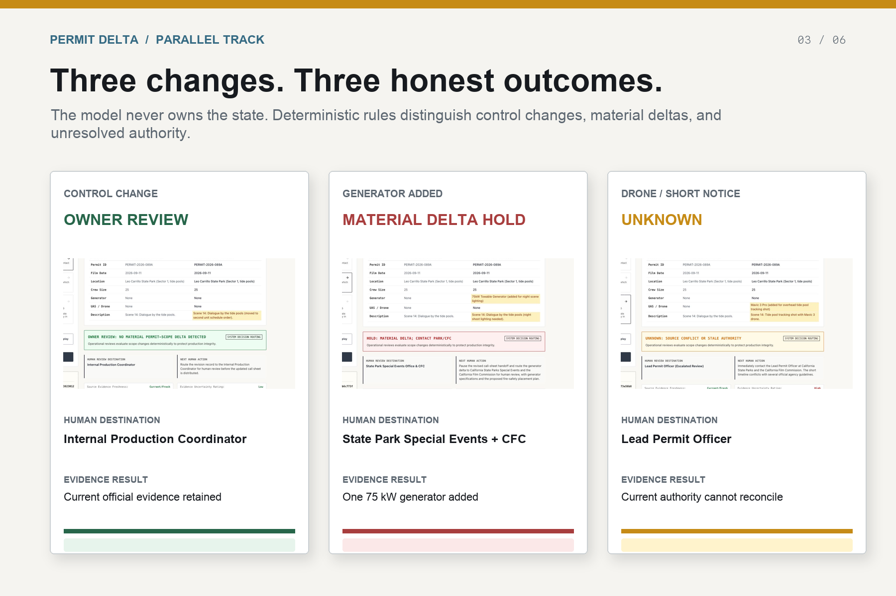
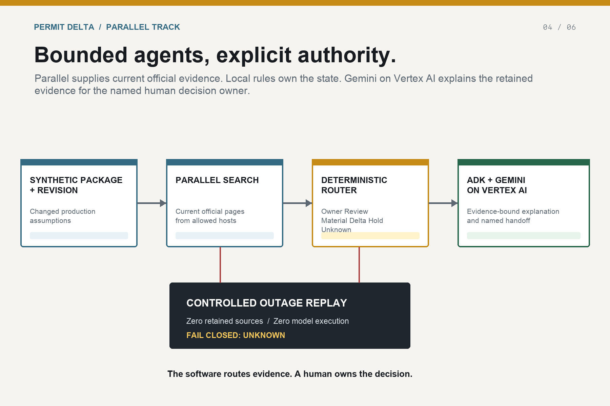

# Permit Delta

Permit Delta is a compact, high-trust operational change review and decision support instrument for film production location managers and coordinators. The application evaluates three fixed synthetic location change scenarios against issued permit parameters, queries official authority guidelines using Parallel when live mode is configured, enforces deterministic local routing safety rules, and uses Gemini 3.7 Flash via Google's ADK (Agent Development Kit) 2.7.1 session runners to explain the resulting operational state and recommended next review destination.

This is a decision support tool. **It does not provide legal advice or autonomous regulatory approval.** It never states or implies that a production plan is allowed, compliant, valid, approved, insured, safe, or exempt from review.



## Public Release

- **Live demo:** https://permit-delta-public-oexevpfpmq-uc.a.run.app (Revision: permit-delta-public-f2a3762763 at 100% traffic)
- **Demo video:** https://youtu.be/ZeFy9WalTeI
- **Data boundary:** Every scenario and contact in the demonstration is synthetic. No customer uploads are supported.
- **Execution boundary:** `Live partners` performs bounded runtime retrieval and explanation via Google Cloud Vertex AI and Parallel Search. `Controlled outage replay` disables both partner calls for one visibly labeled request and demonstrates the fail-closed path.

---

## Judge Quickstart

The complete judging path takes about three minutes and requires no account or private data:

1. Open the **Live demo** above. The workspace loads with synthetic permit and production-plan data.
2. Select **Added generator**, keep **Live partners** selected, and choose **Run Operational Review**. Confirm that one added 75kW generator produces `HOLD: MATERIAL DELTA; CONTACT PARK/CFC`, an explicit human destination, official-source evidence, and observed partner/model execution metadata.
3. Review the three bounded outcomes below. They intentionally separate an owner-review candidate, a mandatory hold, and an unknown state instead of collapsing every change into a generic answer.
4. Select **Contact and schedule**, switch to **Controlled outage replay**, and run one review. Confirm that the result fails closed to `UNKNOWN`, retains zero sources, and marks both Parallel and Gemini as skipped.
5. Click **Coordinator Brief (.txt)** or **Technical JSON** to generate a readable brief or raw payload of the current state.

The model explains evidence and next steps; deterministic application logic owns every top-level state.



---

## Why Parallel Is Load-Bearing

Permit Delta does not use web retrieval as decorative citation generation. Parallel supplies current, domain-restricted authority evidence to the decision pipeline. For a non-hold scenario to reach `OWNER REVIEW`, the local router requires at least two fresh, allowed, diverse authority sources. Missing, stale, conflicting, or disallowed evidence forces `UNKNOWN`.

The in-product **Controlled outage replay** proves that dependency from the same release: it prevents Parallel client construction, retains zero sources, skips Gemini because there is no evidence to explain, and visibly fails closed. Scenario 2 remains a deterministic `HOLD` because the added generator is itself a material permit-scope delta; retrieval cannot weaken that state.

---

## Controlled Scenarios

The workspace evaluates three fixed synthetic demo scenarios representing common production change patterns (it is not an arbitrary real-time plan ingestion product):

1. **Scenario 1: Control Change**
   - *Delta:* Alters scene schedule order and updates an internal, non-permit contact number.
   - *Deterministic Route:* `OWNER REVIEW: NO MATERIAL PERMIT-SCOPE DELTA DETECTED` (Requires at least two distinct verified official sources meeting host diversity invariants and a safety-validated model explanation).
   - *Destination:* Internal Production Coordinator.

2. **Scenario 2: Material Change**
   - *Delta:* Adds exactly one 75kW diesel towable generator to a state park tide-pool location.
   - *Deterministic Route:* `HOLD: MATERIAL DELTA; CONTACT PARK/CFC` (Model fallbacks and scenario data are synthetic).
   - *Destination:* State Park Special Events Office & CFC.

3. **Scenario 3: Short-Notice Drone Addition**
   - *Delta:* Adds a commercial drone (UAS) tracking shot exactly 5 business days before filming.
   - *Deterministic Route:* `UNKNOWN: ESCALATION FOR MANUAL REVIEW` (Predetermined manual escalation; routing logic enforces escalation to manual authority review regardless of evidence retrieval diversity).
   - *Destination:* Lead Permit Officer.

---

## Architectural & Safety Mandates



1. **Deterministic Decision Control**: Top-level states are completely owned by local deterministic application routing logic. The Gemini model generates safety-neutral explanation narratives but may never create, weaken, or upgrade a decision state.
2. **Hard Evidence Diversity Invariant**: For non-hold scenarios (Scenario 1 & 3), deterministic routing strictly requires **at least two distinct, allowed production-authority hosts and classes** (e.g., California State Parks and California Film Commission). If evidence is insufficient, it immediately fails closed to `UNKNOWN`.
3. **Fail-Closed Model Safety Scanning**: If the model output contains authorizing language (including `allowed`, `compliant`, `valid`, `approved`, `insured`, `safe`, `exempt`, `proceed`, `cleared`, `authorized`, `permitted`, `lawful`, `no further submission`, `does not require`, `go ahead`, or `meets requirements`), or if generation fails, Scenario 1 immediately fails closed from `OWNER REVIEW` to `UNKNOWN`.
4. **Partner-Off Clean Hand**: When `LIVE_PARTNERS=False` or the operator selects `Controlled outage replay`, the application returns **zero** retrieved sources (`[]`). It does not construct a Parallel client, call Gemini without retained evidence, or present fabricated sources as retrieved. Non-hold scenarios (1 & 3) route directly to `UNKNOWN`, while Scenario 2 preserves its deterministic `HOLD` state for the added generator.
5. **Authoritative Domain Restrictions**: Live Parallel Web Search is filtered strictly to HTTPS domains for California Film Commission (`film.ca.gov`), California State Parks (`parks.ca.gov`), and the FAA (`faa.gov`).
6. **No Secrets/Credentials in Source**: The application does not use API keys for Gemini. Production and local live inference use Google Cloud Application Default Credentials (ADC) with `GOOGLE_CLOUD_PROJECT` and `GOOGLE_CLOUD_LOCATION`.

---

## Data Sources & Safety

- Every permit, plan, location record, schedule, and contact shown in the demo is synthetic. No customer or production-company data is included.
- Runtime retrieval is restricted to HTTPS pages on `film.ca.gov`, `parks.ca.gov`, and `faa.gov`; exact host checks prevent lookalike domains from entering the evidence set.
- Provider status is reported as observed execution metadata, controlled replay, or fallback. Synthetic fallback text is never presented as live retrieval.
- Gemini receives only retained evidence and a predetermined decision state. It can explain that state, but it cannot authorize activity or override the router.
- Secrets stay server-side in Google Cloud. The browser bundle and public repository contain no API keys or credentials.

---

## Technical Stack

- **Backend**: Python 3.12 + FastAPI 0.141.1.
- **Inference**: Google ADK 2.7.1 and Google GenAI 2.19.0.
- **Search**: Parallel Python SDK 1.3.0 (`AsyncParallel` callable).
- **Frontend**: React 18, TypeScript, Vite. Served statically from FastAPI in production.

---

## Source Map for Judges

- [`backend/app/search.py`](backend/app/search.py) constructs the official `AsyncParallel` client with zero SDK retries and performs the bounded runtime search.
- [`backend/app/gemini.py`](backend/app/gemini.py) defines the explanation agent and executes it through Google ADK's `InMemoryRunner` on Vertex AI.
- [`backend/app/router.py`](backend/app/router.py) owns source validation, evidence diversity, deterministic states, and fail-closed routing.
- [`backend/app/api.py`](backend/app/api.py) binds the explicit request, partner mode, search receipt, route, model receipt, and controlled replay behavior.
- [`frontend/src/App.tsx`](frontend/src/App.tsx) implements the judge-visible scenario, partner-mode, execution, evidence, and receipt workflow.

---

## Local Setup & Execution

### Prerequisites
- Python 3.12 (standard venv)
- Node.js 20+

### 1. Environment Configuration
Copy the template to create a `.env` file:
```bash
cp .env.template .env
```
To run in **Live Mode**, configure Vertex AI Application Default Credentials and configure `.env` as follows:
```ini
GOOGLE_CLOUD_PROJECT=your-google-cloud-project-id
GOOGLE_CLOUD_LOCATION=global
GOOGLE_GENAI_USE_VERTEXAI=True
PARALLEL_API_KEY=your-parallel-api-key-here
LIVE_PARTNERS=True
```
If `LIVE_PARTNERS=False` (default), the tool operates in **Offline Safety Fallback** mode, displaying zero retrieved sources and failing closed non-hold scenarios to `UNKNOWN` to truthfully represent lack of live evidence.

The in-product **Partner execution** control defaults to `Live partners`. `Controlled outage replay` is a per-request, visibly labeled zero-call path for demonstrating load-bearing partner behavior from the same release revision. Changing either a scenario or partner mode clears the prior result before another explicit review.

### 2. Run Backend
```bash
cd backend
python3.12 -m venv venv
source venv/bin/activate
pip install -r requirements.txt
python -m uvicorn main:app --host 127.0.0.1 --port 8000
```
The FastAPI server runs at `http://127.0.0.1:8000`.

### 3. Run Frontend (Development)
Open a separate terminal window:
```bash
cd frontend
npm install
npm run dev
```
The Vite dev server runs at `http://localhost:3000` and proxies `/api` calls to the FastAPI backend.

---

## Production Build & Containerization

To run the unified, same-container production build locally:

### 1. Build Docker Container
```bash
docker build -t permit-delta .
```

### 2. Run Docker Container
```bash
docker run -p 8000:8000 \
  -e LIVE_PARTNERS=False \
  permit-delta
```
Visit `http://localhost:8000` to interact with the production bundle served directly by FastAPI.

---

## Testing & Verification

Focused unit and mock integration tests verify routing logic, exact-match hosts, denylist checks, Parallel response structures, Google ADK session runner states, explicit review activation, scenario/mode evidence binding, zero-call controlled replay, truthful offline/failed metadata, and frontend accessibility semantics.

Run pytest inside the `backend` folder:
```bash
cd backend
python -m pytest tests/ -v
```

Run the focused frontend tests inside the `frontend` folder:
```bash
cd frontend
npm test
```

---

## Verification Status

### Current Candidate Verification (September 8, 2026)
- **Candidate:** `f2a37627631c4899661ae08cfc96a98d0d1d45fe` (Branch: `release-finish-20260908`)
- **Revision:** `permit-delta-public-f2a3762763` (Digest: `sha256:a95c9cdb0126b8f2cf789abbfe84240c1f462aef5f733f0ddee6d98945e71b3e`)
- **Hosted Evidence Session:** September 8, 2026, 9:18-9:21 PM Eastern. Continuous CDP screencast recorded actual hosted interactions on desktop and 390x844 mobile viewports. No synthetic results or mocked app frames were used.
- **Added generator (Live):** Routed to `HOLD: MATERIAL DELTA; CONTACT PARK/CFC` (Destination: State Park Special Events Office & CFC). Next action pauses revised call-sheet handoff for generator specifications and proposed fire-safety placement review. Correlation `49762f4e-2b06-4953-b6b4-68a209373cc3`. Parallel observed (`search_57535c349ee0c59083e1a48474bf57df`, 5 retained sources). Vertex Gemini observed and validated (`gemini-3.7-flash`). Note: References include general rules and noisy navigation text, not proof of applicability. Do not imply every result is relevant or a legal finding.
- **Contact and schedule (Live):** Routed to `OWNER REVIEW: NO MATERIAL PERMIT-SCOPE DELTA DETECTED` (Destination: Internal Production Coordinator). Correlation `44139564-d377-4d5e-aa10-bbb21f3a7a7c`. Parallel observed (`search_dc2cef565e6e873b6949bf3e9663e13f`, 4 retained sources). Vertex Gemini observed and validated (`gemini-3.7-flash`). Routing is deterministic, not a legal approval.
- **Contact and schedule (Offline Replay):** Routed to `UNKNOWN: ESCALATION FOR MANUAL REVIEW` (Destination: Lead Permit Officer). Correlation `fb9af30a-07a9-4acf-9845-bed7eba154ef`. Search skipped, model skipped, no Vertex observation, 0 retained sources.
- **Export:** The Coordinator Brief (.txt) button was clicked on the hosted generator result. The implementation generates a readable brief for download, awaiting owner confirmation of browser-file delivery.

### Historical Reference Release (93c24751eb)
The live public service now serves `permit-delta-public-f2a3762763` at 100% traffic (with `93c24751eb` retained for rollback). The legacy YouTube demo video depicts that historical release while a replacement is in preparation. For historical reference, that prior release recorded:
- **Local tests and build:** 28 focused backend tests and 12 focused frontend tests passed, and the frontend production build compiled successfully.
- **Private live runtime evidence:** One accepted private revision completed three one-shot live scenarios plus one controlled replay. The live scenarios recorded Parallel and Gemini on Vertex AI metadata; the replay recorded zero retained sources, skipped both partners, and failed closed. The sequence used no retries.
- **Presentation repair:** The release source changes only the presentation layer relative to that accepted private runtime. Its hosted desktop `1440x900` and mobile `390x844` controlled-replay comparison measured zero horizontal overflow with no partner calls.
- **Public runtime:** The public Cloud Run service uses the validated release image without a new Cloud Build. One bounded zero-partner replay returned `UNKNOWN`, retained zero sources, skipped both partners, and made no provider call or retry.
- **Public video:** The 155-second narrated release video is publicly visible on YouTube with published English captions.
